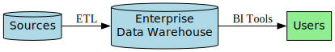
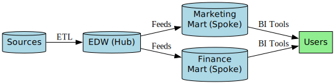
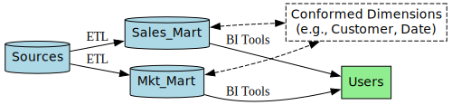
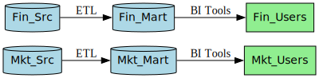
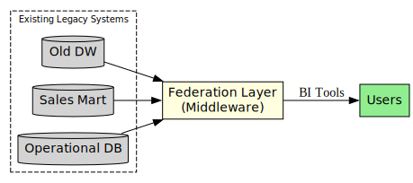
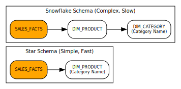

#### **Part 1: The Fundamental Problem (Why We Need a DW)**

Systems designed for daily operations (**OLTP**) are terrible for business analysis (**OLAP**).

| Feature | **OLTP (Online Transactional Processing)** | **OLAP (Online Analytical Processing)** |
| :--- | :--- | :--- |
| **Purpose** | **Run the business** (process a sale, update inventory). | **Analyze the business** (analyze sales trends, forecast). |
| **System Type** | Operational Database (e.g., your website DB). | **Data Warehouse**. |
| **Data Model** | **Normalized** (many small tables, no redundancy). | **Denormalized** (few large tables, some redundancy). |
| **Reasoning** | Optimized for fast **`INSERT`/`UPDATE`/`DELETE`** of single rows. | Optimized for fast **`SELECT` and aggregation** of millions of rows. |
| **Query Speed** | Fast for simple transactions. | **Extremely slow** for analytical queries due to many expensive **table `JOIN`s**. |
| **Data** | Current, up-to-the-second. | **Historical**, aggregated over time. |

---

#### **Part 2: The Core Blueprint (What a DW IS)**

**A. Inmon's 4 Foundational Characteristics:**
A data warehouse is a collection of data that is:
1.  **Subject-Oriented:** Organized around business concepts like `Customer`, `Product`, `Sales`.
2.  **Integrated:** Data from many sources is cleaned and made consistent. It's the **single source of truth**.
3.  **Time-Variant:** It stores a long history of data as snapshots, essential for **trend analysis**.
4.  **Non-Volatile:** Once loaded, data is **never changed or deleted**. It is a read-only historical record.

**B. The 3-Tier Architecture:**
1.  **Bottom Tier (Data Acquisition & Storage):** The back-end. Includes data sources, ETL tools, the staging area, and the warehouse database server itself.
2.  **Middle Tier (Information Access):** The "brain." An **OLAP Server** that structures data for analysis.
    *   **ROLAP (Relational):** Uses a relational DB. Slower but can handle massive data volumes.
    *   **MOLAP (Multidimensional):** Uses a specialized "cube" structure. Extremely fast but less scalable.
    *   **HOLAP (Hybrid):** Combines ROLAP for details and MOLAP for summaries.
3.  **Top Tier (Information Delivery):** The front-end. The **BI tools** (Tableau, Power BI), reporting software, and query tools that users interact with.

---

#### **Part 3: Dependent vs. Independent Data Marts (Critical Justification Point)**

For any enterprise-level analysis, **dependent data marts** are the correct strategic choice. An independent approach is a tactical error that creates long-term problems.

| Feature | **Dependent Data Marts (Correct Choice)** | **Independent Data Marts (Incorrect Choice)** |
| :--- | :--- | :--- |
| **Data Source** | Draws from a central **Enterprise Data Warehouse (EDW)**. | Draws directly from operational sources. |
| **Consistency** | **Guaranteed.** All marts use the same definitions and business rules from the **single source of truth**. | **None.** Leads to **inconsistent metrics** and conflicting reports. |
| **Governance** | **Centralized governance** and data quality control. | **Decentralized chaos.** Each department defines its own rules. |
| **Cost / Effort** | High initial effort for the EDW, but low effort to create new marts. **Efficient** in the long run. | Low initial effort per mart, but massive **duplicated effort** and high maintenance costs overall. |
| **Key Outcome**| A **holistic, enterprise-wide view** of the business. | **Data silos** that make enterprise-level analysis impossible. |

**Exam Justification Template:** Governence, Consistency, Cost & Effort
"The recommendation is to build **dependent data marts**. The primary goal of the project is to achieve [mention goal, e.g., 'national-level policy planning' or 'a 360-degree customer view']. This requires a **single source of truth**, which only a dependent model drawing from a central EDW can provide. An independent approach would inevitably lead to **data silos** and **inconsistent metrics** (e.g., one department defining 'active user' differently from another), rendering any enterprise-level analysis unreliable and invalid."

---

#### **Part 4: The Strategic Decision (Inmon vs. Kimball)**

This is the high-level philosophical choice you make before building.

| Feature | **Top-Down Approach (Bill Inmon)** | **Bottom-Up Approach (Ralph Kimball)** |
| :--- | :--- | :--- |
| **Philosophy**| Build the central **Enterprise Data Warehouse (EDW) first**. | Build individual, business-focused **Data Marts first**. |
| **Process** | Create a comprehensive, normalized EDW, then spin off **dependent data marts**. | Create dimensional data marts, then integrate them with **conformed dimensions**. |
| **Focus** | Enterprise-wide **consistency** and data integrity. | Departmental needs and **speed of delivery**. |
| **Pros** | **Single source of truth**; strong governance; highly scalable. | **Fast time-to-value**; lower initial cost; high user involvement. |
| **Cons** | High upfront cost; long development time; less flexible. | Risk of inconsistent **data silos**; complex integration later. |

---

#### **Part 5: The 5 Key Architectural Models (The Blueprints)**

##### **1. Centralized Data Warehouse (Pure Inmon)**
A single, massive EDW serves all users directly. No data marts.
*   **Best for:** Mid-sized organizations with uniform data needs.

##### **2. Hub-and-Spoke (Practical Inmon)**
A central EDW (the "hub") feeds data to **dependent data marts** (the "spokes"). **This is the most popular, robust architecture.**
*   **Best for:** Large enterprises with diverse user groups needing both **central governance** and high performance.

##### **3. Data Mart Bus (Kimball)**
Individual data marts are built first and linked by **conformed dimensions**. The "warehouse" is the logical combination of these marts.
*   **Best for:** Agile organizations needing quick wins, with strong governance to enforce conformed dimensions.

##### **4. Independent Data Marts (The Anti-Pattern)**
Departments build their own marts with no coordination. **This architecture is considered a failure.**
*   **Consequence:** Inconsistent **data silos**, impossible to get an enterprise view.

##### **5. Federated Data Warehouse (The Pragmatic Integrator)**
A **virtual warehouse**. It leaves existing systems in place and uses middleware to provide a unified logical view.
*   **Best for:** Companies post-merger that need to integrate disparate legacy systems **quickly** without a full rebuild.

---

#### **Part 6: Dimensional Modeling (The Design Blueprint)**

This is how you design the tables inside the warehouse for fast, intuitive analysis.

**A. Star Schema vs. Snowflake Schema**
The **Star Schema** is the preferred standard. Snowflake is a variation that should generally be avoided.

| Feature | **Star Schema (Preferred)** | **Snowflake Schema (Avoid)** |
| :--- | :--- | :--- |
| **Structure** | Central **Fact Table** connected directly to multiple **denormalized** Dimension Tables. | A Star Schema where the Dimension Tables have been **normalized** into smaller, related tables. |
| **Joins** | **Minimal joins** required for a query. | **Many joins** required, traversing the "snowflake" structure. |
| **Performance**| **Very Fast** query performance. | **Slower** query performance due to additional joins. |
| **Usability** | **Intuitive** and easy for business users to understand. | **Complex** and difficult for users to navigate. |

**B. Table Characteristics:**

| Fact Table | Dimension Table |
| :--- | :--- |
| **Deep** (billions of rows) | **Shallow** (thousands of rows) |
| **Narrow** (few columns: keys & numbers) | **Wide** (many columns: descriptive text) |
| Stores **Measures** (the numbers). | Stores **Context** (the "who, what, where, when"). |
| Has a **concatenated primary key**. | Has a single primary key (**surrogate key**). |
| Defines the **Grain** (what one row represents). | Defines **Hierarchies** (paths for analysis). |

**C. Dimension Hierarchies:**
These are logical structures within a dimension that allow users to analyze data at different levels of summary. They are the paths for **drilling down** and **rolling up**.
*   **Example (Time):** Year -> Quarter -> Month -> Day
*   **Example (Geography):** Country -> Region -> State -> City

**D. Key Fact & Dimension Table Concepts:**
*   **Grain:** The definition of what a single row in a fact table represents (e.g., "one line item on a sales receipt"). Must be defined first.
*   **Additivity:**
    *   **Fully Additive:** Can be summed across all dimensions (e.g., `Sales_Amount`).
    *   **Semi-Additive:** Cannot be summed across the time dimension (e.g., `Inventory_Balance`).
    *   **Non-Additive:** Cannot be summed at all (e.g., `Margin_Percentage`).
*   **Degenerate Dimension:** An operational ID (e.g., `Order_Number`) placed directly in the fact table.
*   **Factless Fact Table:** Records an event with no numeric measure (e.g., student attendance).
*   **Slowly Changing Dimensions (SCDs):** How to handle changes to dimension attributes over time.
    *   **SCD Type 1: Overwrite.** The old value is replaced. **No history is kept.** (Use for correcting errors).
    *   **SCD Type 2: Add New Row.** **Preserves full history.** The old row is expired (with an `EndDate`), and a new row is created (with a `StartDate`). This requires using **surrogate keys**.

---

#### **Part 7: The ETL Process (Populating the DW)**

1.  **Extract:** Pulling raw data from **heterogeneous source systems** (databases, files, APIs) using **bulk** (initial) and **incremental** (ongoing) loads.
2.  **Transform:** The most complex step, performed in a **Staging Area**.
    *   **Cleansing:** Fixing errors, handling null values.
    *   **Standardizing & Conforming:** Creating consistent formats and mapping different source IDs to a single **conformed dimension**.
    *   **Aggregation:** **Summarizing** raw data into meaningful business **measures (facts)**.
3.  **Load:** Loading clean data into the warehouse, dimensions first to ensure **referential integrity**. Use **partitioning** and **indexing** to optimize performance.

---

#### **Part 8: OLAP and Cube Navigation (Using the DW)**

The **OLAP Cube** is the logical, multidimensional structure (composed of measures and dimensions) that allows for fast and intuitive data analysis.
*   **Slice:** Filtering on a single value of one dimension (e.g., `Year = 2023`).
*   **Dice:** Filtering on multiple values across multiple dimensions (e.g., `Year = 2023` AND `Region = 'North'`).
*   **Drill-Down:** Navigating down a hierarchy to see more detail (e.g., `Year` -> `Month`).
*   **Roll-Up:** Aggregating data by moving up a hierarchy (e.g., `City` -> `Country`).
*   **Pivot (Rotate):** Swapping the axes of the view (e.g., moving `Products` from rows to columns).

---
#### **Part 9: Justification Framework (With vs. Without a DW)**

| Feature | **Consequences Without a DW (The Problem)** | **Benefits With a DW (The Solution)** |
| :--- | :--- | :--- |
| **Data Consistency**| **Data silos** and **inconsistent metrics** lead to a lack of trust in data and conflicting reports. | A **single source of truth** provides trusted, consistent data for the entire organization. |
| **Decision-Making** | **Slow, inefficient, and reactive.** Analysts waste time on data preparation, delaying critical insights. | **Fast, efficient, and proactive.** Optimized queries enable rapid analysis and timely, data-driven decisions. |
| **Strategic Planning**| A **holistic, enterprise-wide view** is **impossible**. Long-term trend analysis is not feasible. | Enables **forecasting and trend analysis** by providing integrated historical data. |
| **System Performance**| Analytical queries **degrade the performance** of live operational systems, impacting customers. | **Protects operational systems** by offloading the analytical workload to a separate, optimized environment. |
